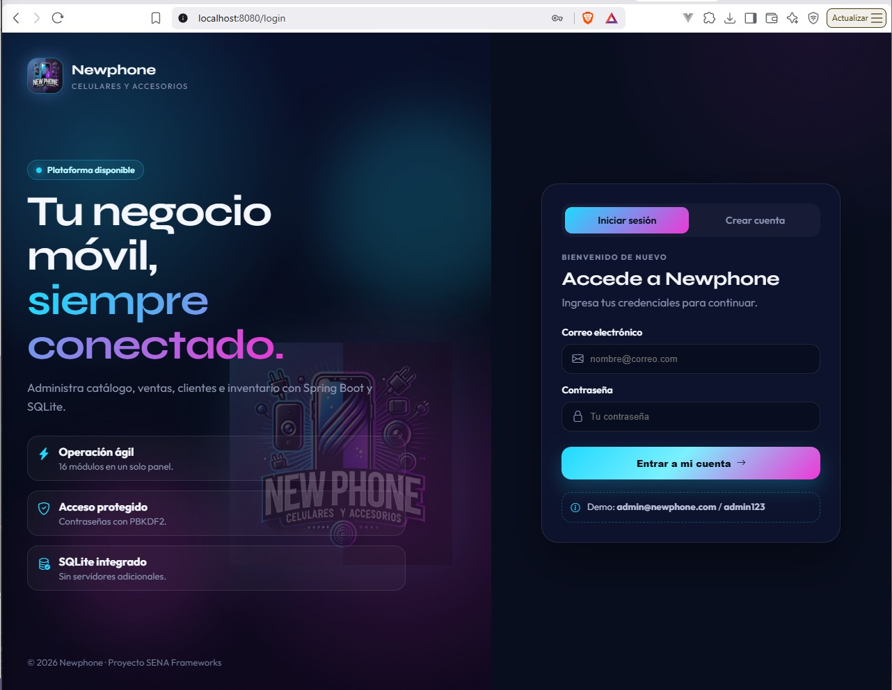
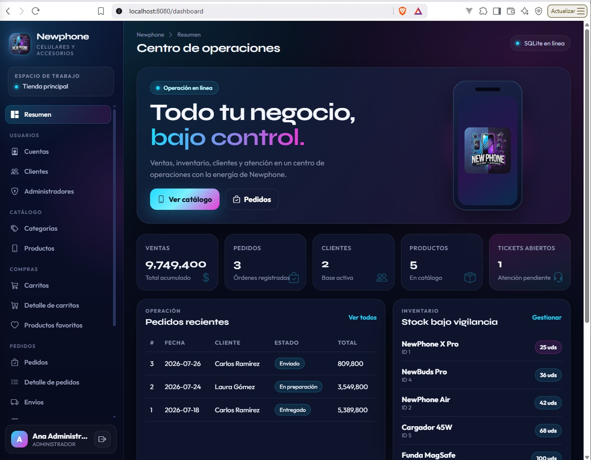
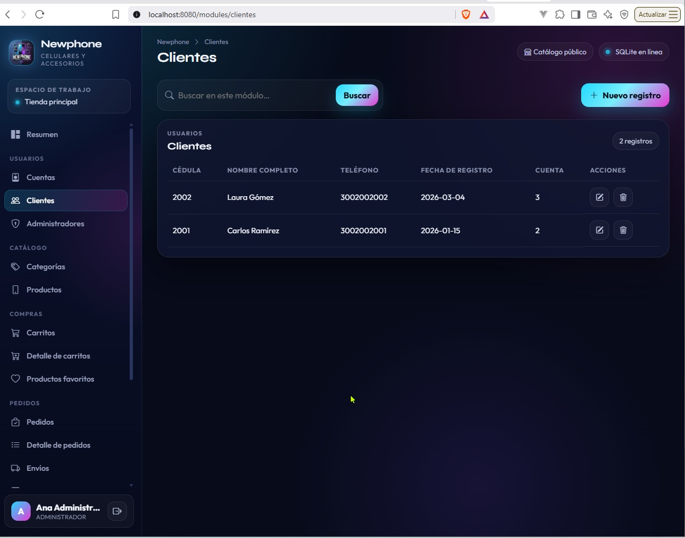
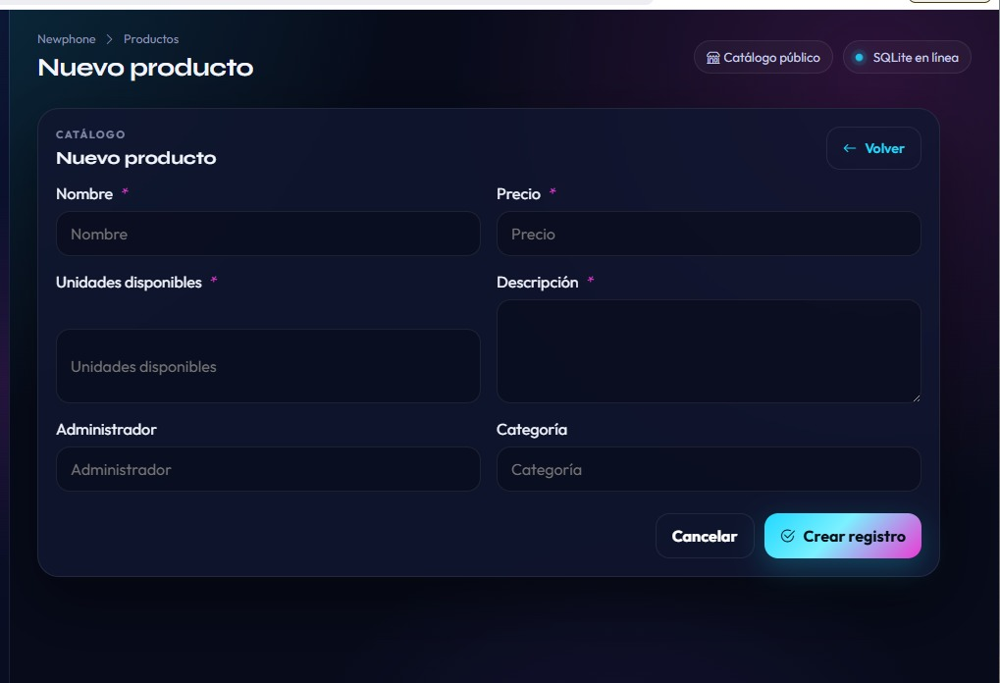
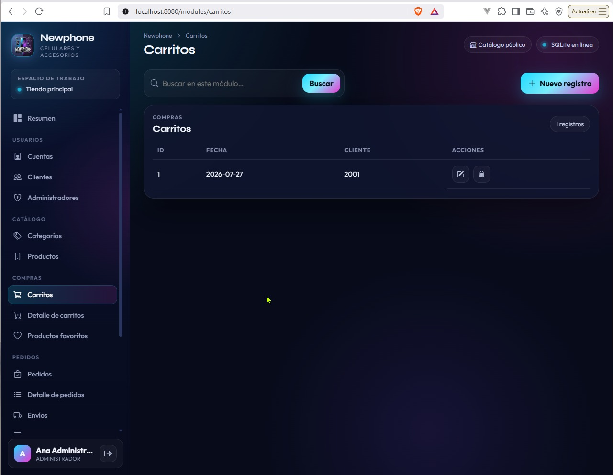

# Newphone — Spring Boot

Versión con **Spring Boot**, **Thymeleaf** y **SQLite** del centro de operaciones
Newphone (celulares y accesorios). Conserva los 16 módulos de la versión en
servlets y los presenta con una interfaz oscura inspirada en el logo oficial.

## Tecnologías

- Java 21
- Spring Boot 4 (Web MVC, Thymeleaf, Validation, JDBC)
- SQLite (sin MySQL ni PostgreSQL)
- Maven

## Funcionalidades

- Login y registro de clientes con sesiones HTTP
- Contraseñas protegidas con PBKDF2 (upgrade automático desde texto plano del seed)
- Dashboard con ventas, pedidos, clientes, inventario y tickets
- CRUD completo de los 16 módulos
- Base de datos y datos de demostración creados automáticamente

## Base de datos

SQLite se inicializa automáticamente en:

```text
%USERPROFILE%\.newphone\newphone-spring.db
```

Para usar otra ruta:

```text
-Dnewphone.database=C:\ruta\personalizada\newphone.db
```

## Acceso demo

```text
Correo: admin@newphone.com
Contraseña: admin123
```

## Catálogo público

Sin iniciar sesión puedes ver el listado de productos en:

```text
http://localhost:8080/
http://localhost:8080/catalog
```

Incluye buscador, filtros por categoría/precio/disponibilidad y ordenación.
Responsive para escritorio y móvil.

## Ejecución en IntelliJ IDEA

1. Abre la carpeta del proyecto como proyecto Maven.
2. Espera a que IntelliJ importe dependencias (`pom.xml`).
3. Confirma **JDK 21** en *File → Project Structure → Project*.
4. Ejecuta la clase `com.newpohone.ProyectoGa722501096Application`
   (clic derecho → **Run**), o usa el panel Maven:

```text
Plugins → spring-boot → spring-boot:run
```

También desde la terminal integrada de IntelliJ:

```powershell
.\mvnw.cmd spring-boot:run
```

La aplicación queda en:

```text
http://localhost:8080
```

## Empaquetado

```powershell
.\mvnw.cmd clean package
java -jar target\proyecto-ga-722501096-1.0.0.jar
```

## Capturas de pantalla

### Catálogo público


### Login



### Dashboard — Centro de operaciones


### Dashboard — Resumen con métricas



### Módulo Cuentas


### Módulo Clientes



### Módulo Administradores


### Módulo Categorías


### Módulo Productos


### Formulario — Nuevo producto



### Módulo Carritos



### Formulario — Nuevo carrito


### Módulo Detalle de carritos


### Módulo Productos favoritos


### Módulo Pedidos


### Módulo Detalle de pedidos


